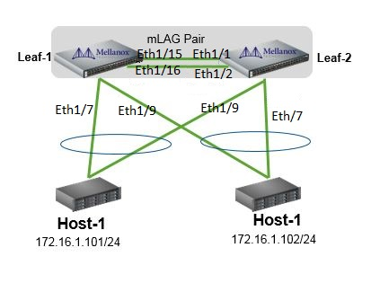

# 2-Switch MLAG Configurations with ansible

This repository consist of ansible configuration files for [MLAG](https://community.mellanox.com/s/article/how-to-configure-mlag-on-mellanox-switches) (Multi-chassis LAG) in Onxy on Mellanox switch systems.
The ansible  as files will configure 2 leaf switches and 2 server as shown in the toplogy.
Run the below:
Before starting install [ansible](https://docs.ansible.com/ansible/latest/installation_guide/intro_installation.html) on a Linux server.
https://github.com/Onyx-poc/Mlag.git
cd Mlag/Onxy_2_Switch_MLAG/
ansible site.yml 

Topology
--------

